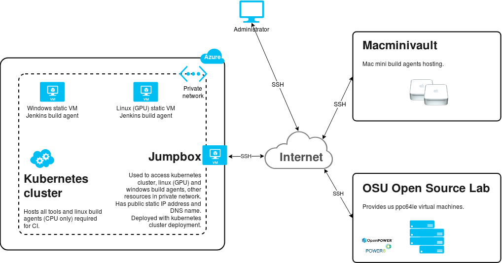

# Description of infrastructure/tools/scripts for CI/CD of Deeplearning4j organization projects

## Brief description of current infrastructure
Currently, our CI/CD infrastructure consists of private k8s cluster that hosts all required CI/CD tools, and build agents.

Also, we do have:
* `macOS boxes`, hosted at [Macminivault](https://www.macminivault.com);
* `ppc64le boxes`, provided by [OSU Open Source Lab](https://oregonstate.edu/);
* `windows box`, deployed on Azure, in the same private network as kubernetes cluster;
* `linux (GPU) box` deployed on Azure, in the same private network as kubernetes cluster.

`macOS` and `ppc64le(CPU)` boxes connected to Jenkins instance via `ssh`,
whereas `ppc64le(GPU)` is using Jenkins `SGE plugin` to create and connect Jenkins `ppc64l-gpu` agents.

Below, you can find general view of all CI/CD tools that are currently in use (Pic. 1).

    
     
    <b>Pic.1 - General view of CI/CD infrastructure</b>

## Kubernetes

## Jenkins

## Nexus

## Build agents

## Jenkins pipeline scripts for CI/CD
