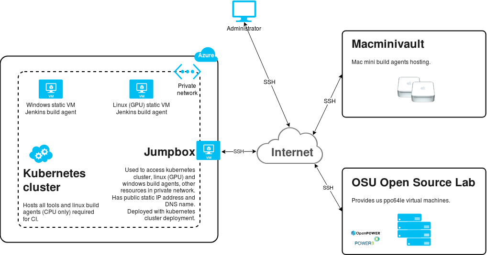

# Description of infrastructure/tools/scripts for CI/CD of Deeplearning4j organization projects

## Brief description of current infrastructure
Currently, our CI/CD infrastructure consists of private k8s cluster that hosts all required CI/CD tools, and build agents.

Also, we do have:
* `MacOS boxes`, hosted at [Macminivault](https://www.macminivault.com);
* `PPC64LE boxes`, provided by [OSU Open Source Lab](https://oregonstate.edu/);
* `Windows box`, deployed on Azure, in the same private network as kubernetes cluster;
* `Linux(GPU) box` deployed on Azure, in the same private network as kubernetes cluster.

`MacOS` and `PPC64LE(CPU)` boxes connected to Jenkins instance via `ssh`,
whereas `PPC64LE(GPU)` is using Jenkins `SGE plugin` to create and connect Jenkins `PPC64LE(GPU)` agents.

Below, you can find general view of all CI/CD tools that are currently in use ([Pic.1](#pic1---general-view-of-cicd-infrastructure)).



###### Pic.1 - General view of CI/CD infrastructure

## Kubernetes
Kubernetes cluster for CI/CD infrastructure was deployed on Azure with the help of [ACS engine](https://github.com/Azure/acs-engine).

Azure resource group name for deployed cluster: `ci-skymind-prod-acs-cluster-03`.

| Name | Version |
| ---- | ------- |
|ACS engine|v0.26.2|
|Kubernetes|v1.11.5|

Private Kubernetes cluster ACS engine template was used for current deployment, it can be found [here](cicd-infrastructure/azure/acs/ci-skymind-cluster/acs-engine-v0.26.2/templates/ci-kubernetes-hybrid-cluster-with-jumpbox-linux-pools-only.json).

Cluster has following agent pools:

| Pool name | Azure instance type | Pool description |
| :-------: | :-----------------: | ---------------- |
|citools|Standard_D4s_v3|Used for CI tools deployment. Currently contains `Jenkins` and `OSS Nexus` instances|
|linuxcpu1|Standard_D4_v3|Used for most of the `Jenkins` build agents.|
|linuxcpu2|Standard_F8s_v2|Used only for `Jenkins` linux `avx512` build agents.|

More details about cluster deployment process and maintenance can be found [here](docs/kubernetes.md).

## Jenkins master

Jenkins master instance deployed on Kubernetes cluster as `StatefulSet` [object](https://kubernetes.io/docs/concepts/workloads/controllers/statefulset/).
Manifest file required for deployment located [here](k8s/ci-skymind/jenkins/deployments/jenkins-prod.yml).

More details about Jenkins instance deployment process and maintenance can be found [here](docs/jenkins.md).

## Jenkins static build agents
All configuration that needs to be done on Jenkins master side is stored in `SCM` and stored [here](k8s/ci-skymind/jenkins/configs/config-prod.yml).

### MacOS build agent
`MacOS build agent` provisioning has been done with `Ansible` scripts that can be found [here](cicd-infrastructure/ansible).

Every time when new `MacOS build agent` needs to be added to the Jenkins agents pool, \
administrator need to add endpoint of a new build agent to [production](cicd-infrastructure/ansible/production) inventory file.

More details about how to run provisioning scripts can be found [here](cicd-infrastructure/ansible/README.md)

### Linux(GPU) build agent
Currently, `Linux(GPU) build agent` was manually configured by administrator.

In general, `Linux(GPU) build agent` requires only latest `Nvidia` drivers and `Docker` to be installed on the VM.

### Windows build agent

<span style="color:orange">_**Every time when Jenkins master version is updated, you need to update tunnel value in Jenkins <b>config-prod.yml</b> for <b>Windows build agent</b> and restart Jenkins agent service!**_</span>

Currently, `Windows build agent` was manually configured by administrator.

To get successful build on `Windows build agent`, following tools are required:
1. Git client;
2. MSYS2;
3. MingW-w64 compiler toolchain;
4. Java 8 JDK;
5. Maven;
6. Jenkins agent installed as a service;
7. Microsoft Visual Studio 2015.

To have more secure environment, separate `Jenkins user` should be created in the system.

More details about builds on Windows can be found [here](https://github.com/bytedeco/javacpp-presets/wiki/Building-on-Windows).

## List of the build tools
List of the build tools and their versions, that are installed on Jenkins build agents

<table>
    <thead>
        <tr>
            <th></th>
            <th colspan=4>OS</th>
        </tr>
    </thead>
    <thead>
        <tr>
            <th colspan=1>Tool/Version</td>
            <th>Android</td>
            <th>Linux</td>
            <th>MacOS</td>
            <th>Windows</td>
        </tr>
    </thead>
    <tbody>
        <tr>
            <td>git</td>
            <td></td>
            <td></td>
            <td></td>
            <td></td>
        </tr>
        <tr>
            <td>cmake</td>
            <td></td>
            <td></td>
            <td></td>
            <td></td>
        </tr>
        <tr>
            <td>gcc/g++</td>
            <td></td>
            <td></td>
            <td></td>
            <td></td>
        </tr>
        <tr>
            <td>JDK</td>
            <td></td>
            <td></td>
            <td></td>
            <td></td>
        </tr>
        <tr>
            <td>maven</td>
            <td></td>
            <td></td>
            <td></td>
            <td></td>
        </tr>
    </tbody>
</table>

## Jenkins pipeline scripts for CI/CD
CI/CD scripts are written with the help of [Jenkins Shared Libraries](https://jenkins.io/doc/book/pipeline/shared-libraries/) to simplify codebase support, reuse, versioning and extending.

Skymind Shared Library for CI/CD is defined on global level in `Manage Jenkins >> Configure System >> Global pipelines Libraries` section.

Default branch is `develop`. To change branch for testing changes in CI/CD scripts, developer needs add following line at the begging of the `Jenkinsfile`:

<span style="color:orange">_**skymind in snippet below is the name of shared library defined in Jenkins global config**_</span>

```
@Library('skymind@<branch-name>') _
```

## Nexus
OSS Nexus instance deployed on Kubernetes cluster as `StatefulSet` [object](https://kubernetes.io/docs/concepts/workloads/controllers/statefulset/).
Manifest file required for deployment located [here](k8s/ci-skymind/nexus/nexus-prod.yml).

More details about Jenkins instance deployment process and maintenance can be found [here](docs/nexus.md).

OSS Nexus instance is used for:
1. Maven dependencies caching;
2. Docker images caching;
3. `dl4j-test-resources` hosting.


