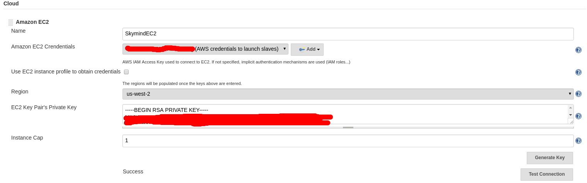
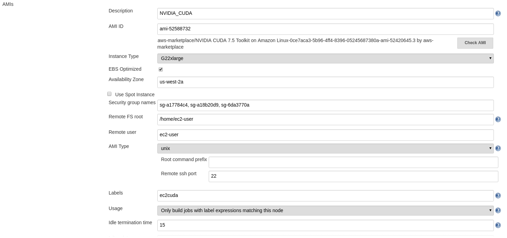

# nvidia-docker (for amd64 architecture) on demand EC2 instance

## Pre requirements:
1. Jenkins (2+ version) with Amazon EC2 (id: ec2), Docker Pipeline (id: docker-workflow) and Ansible (id: ansible) plugins.
2. AWS credentials with preconfigured security group(s), keypair(s), etc.
3. NVIDIA CUDA Toolkit 7.5 on Amazon Linux with accepted agreement for use.

## Configuration:
1. Jenkins amazon EC2 plugin:

- Go to **Manage Jenkins** -> **Cloud** and in **Amazon EC2** section and fill out fields according to yours:

<p align="center">
  
</p>

<p align="center">
  
</p>

- And in **Init script** field define what need to do during provision EC2 slave of Jenkins:

``` bash
sudo yum update -y
sudo yum install git -y
sudo pip install ansible
sudo yum install docker -y
sudo usermod -G docker ec2-user
wget -P /tmp http://us.download.nvidia.com/XFree86/Linux-x86_64/367.57/NVIDIA-Linux-x86_64-367.57.run
sudo bash /tmp/NVIDIA-Linux-x86_64-367.57.run -s
```